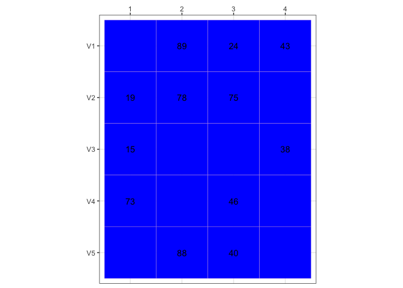

<!-- README.md is generated from README.Rmd. Please edit that file -->

# ggtilematrix

<!-- badges: start -->

[](https://CRAN.R-project.org/package=ggtilematrix)
[](https://lifecycle.r-lib.org/articles/stages.html#experimental)
<!-- badges: end -->

The goal of ggtilematrix is to produce labelled matrices for teaching
and explanatory usage using ggplot2.

## Installation

You can install the development version of ggtilematrix like so:

``` r
# install.packages("remotes")
remotes::install_github("cynthiahqy/ggtilematrix")
```

## Example

This is a basic example which shows you how to solve a common problem:

``` r
library(ggtilematrix)
library(ggplot2)
## basic example code

matrices$unnamed |>
  gg_tilematrix.matrix()
#> Warning: Removed 8 rows containing missing values or values outside the scale range
#> (`geom_text()`).
```


